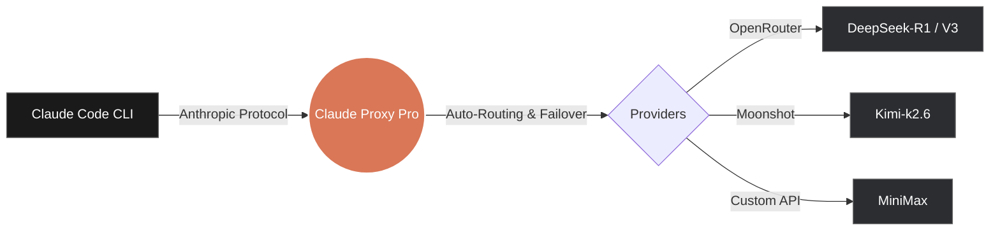

<div align="center">

# 🦀 Claude Proxy Pro

Claude Code is Anthropic's AI coding agent — powerful but expensive. Claude Proxy Pro lets you use it for free by routing requests to any AI provider you choose through a blazing-fast, native desktop application. No background terminal servers, no complex dependencies—just one click to route your traffic to any provider.

[](https://opensource.org/licenses/MIT)
[](https://go.dev/)
[](https://wails.io/)
[](#)
[](#)
[](#)

[The Problem](#-the-problem) · [The Solution](#-the-solution-native-dominance) · [Quick Start](#-quick-start) · [Providers](#-supported-providers) · [Local Build](#-build-it-locally-the-hacker-way)

</div>

<br>

<div align="center">
  
  <br><br>
  <p align="center">
    
    
  </p>
  <p align="center">
    
    
  </p>
</div>

## 💸 The Problem
Let's be honest. Anthropic's Claude Code is arguably the most powerful agentic coding tool available today. It writes code, runs tests, and navigates your codebase like a senior engineer. 

**But there's a massive catch.** 
Its heavy reliance on autonomous "thinking" and "tool-use" loops consumes tokens at a terrifying, wallet-destroying rate. You buy a $50 credit, type `hello`, Claude decides to read your entire `node_modules` folder to find the context, and boom—your quota is gone. You practically have to sell a kidney just to add a single new feature to your project.

## 🚀 The Solution: Native Dominance
You need a proxy. But existing open-source proxies (like Python/Node wrappers) are a nightmare:
- You have to install Python, `pip`, `uv`, or `npm`.
- You have to run a background server (`proxy-server`) in a terminal tab and pray it doesn't crash.
- You are forced to run their custom wrapper commands (like `fcc-claude` or `claude-wrapper`) instead of the native `claude` command you know and love.
- They consume 300MB+ of RAM just to forward JSON requests.

**Claude Proxy Pro puts an end to this madness.**

### 🥊 The Head-to-Head Comparison

| Feature | Claude Proxy Pro 🦀 | Traditional CLI Wrappers (Python/Node) |
|---------|---------------------|----------------------------------------|
| **Core Engine** | Pure Go (Compiled Native Desktop App) | Python / Node.js Scripts |
| **App Size** | **~9.7 MB** Binary 🔥 | 100MB+ Runtimes & Dependencies |
| **RAM Usage** | **~88 MB** | 150 MB - 300 MB+ |
| **The Command** | Just type `claude` (Works natively!) | Forced to type `fcc-claude` or wrappers |
| **IDE Extensions** | Works flawlessly (VS Code / JetBrains) | Break easily / Require complex setups |
| **Background Processes**| **None.** Pin to Dock and forget. | Requires keeping a terminal server running |
| **User Interface** | Sleek Native Glassmorphism GUI | Terminal only + clunky local web admin |
| **Claude Sync** | **100% Automatic** | Manual environment variables or scripts |

**Our app is smaller than your desktop wallpaper.** Just 9.7MB of pure native power. Everything is right in front of your eyes.

## ✨ What You Get
- **Drop-in Native Proxy:** Routes Claude Code's Anthropic API calls to any provider seamlessly.
- **Zero Background Servers:** Pin it to your dock. No need to keep a terminal window open.
- **Sleek Glassmorphism UI:** Manage everything through a beautiful dashboard, not a text file.
- **100% Automatic Sync:** No manual editing of `settings.json`. Click "Activate" in the UI, and your `claude` command is instantly updated.
- **Live Hacker Terminal:** Watch your proxy route traffic in real-time with built-in Matrix-style live system logs.
- **Hot-Swapping:** Change your active provider or model in the middle of a coding session with one click—Claude Code will pick up the change instantly without breaking.

## ⚡ Quick Start

### 1. Download the App
Head over to our [Releases Page](../../releases) and download the pre-compiled version for your system:
- **macOS:** Download the `.dmg` file, open it, and drag the app to your Applications folder. *(See [Gatekeeper Note](#-macos-gatekeeper) below)*
- **Windows:** Download the `.exe` and run it.
- **Linux:** Download the binary and execute it.

### 2. Add Your Provider
1. Open the app and navigate to the **Providers** tab.
2. Select a preset (e.g., OpenRouter, DeepSeek, OpenCode) or add a custom endpoint.
3. Enter your API Key and click **Save**.

### 3. Activate a Model
1. Go to the **Models** tab and click **Sync Models**.
2. Pick the model you want (like `DeepSeek-R1` or `claude-3-7-sonnet`) and hit **Activate**.
3. **Open your terminal and run `claude`. That's it!**

*(Our app automatically injects the necessary routing aliases into your `settings.json` AND automatically adds the `export ANTHROPIC_BASE_URL` to your `~/.zshrc`, `~/.bashrc`, or Windows Registry. You literally do zero manual setup!)*

<div align="center">
  <!-- TODO: Insert Settings Sync GIF Here -->
  <em>*Auto-sync demonstration GIF coming soon!*</em>
</div>

## 🧠 The Magic: How it works

Traditional proxies force you to manage configuration files manually. You have to locate `~/.claude/settings.json`, copy-paste model hashes, and set environment variables. 

We automated the entire process. When you activate a model in the UI, the Go engine instantly injects the required routing aliases into your system's Claude Code settings.



## 🛠 Build It Locally (The Hacker Way)

Since Claude Proxy Pro is 100% open source, you don't have to rely on our pre-built binaries. You can compile the native app locally on your machine in seconds.

### Requirements
- [Go 1.23+](https://go.dev/dl/)
- [Wails v2](https://wails.io/docs/gettingstarted/installation) (`go install github.com/wailsapp/wails/v2/cmd/wails@latest`)

### Build Steps

```bash
# 1. Clone the repository
git clone https://github.com/Xoner1/claude-proxy-pro.git
cd claude-proxy-pro

# 2. Build the app natively
wails build -clean

# 3. Open your brand new Native App!
# (macOS)
open build/bin/claude-proxy-pro.app
# (Windows)
start build/bin/claude-proxy-pro.exe
# (Linux)
./build/bin/claude-proxy-pro
```

## 🌐 Supported Providers

Claude Proxy Pro supports **ANY** provider that exposes an OpenAI-compatible `/v1/models` and `/v1/chat/completions` endpoint, or native Anthropic endpoints. 

Our Quick-Add presets currently include:
- **llm7.io** (`https://api.llm7.io/v1`) - *FREE 5M tokens/day!*
- **OpenRouter** (`https://openrouter.ai/api/v1`)
- **DeepSeek** (`https://api.deepseek.com/v1`)
- **OpenCode Zen** (`https://opencode.ai/zen/v1`)
- **OpenCode Go** (`https://opencode.ai/zen/go/v1`)
- **Groq**, **Together**, **Ollama**, **Mistral**, and many more!

## 🍎 macOS Gatekeeper

Since we are an open-source project and haven't paid Apple $99/year for a Developer Certificate, macOS will show a warning saying **"Developer cannot be verified"** when you first open the app.

**The 3-Second Fix:**
1. Open your **Applications** folder.
2. **Right-Click** (or Control+Click) on `Claude Proxy Pro`.
3. Select **Open** from the menu.
4. Click **Open** again on the warning dialog.

*(You only need to do this once!)*

---

<div align="center">
  <em>Built for speed, stability, and the open-source community.</em>
</div>
