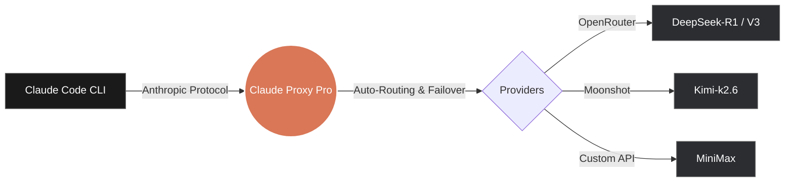

<div align="center">

# 🦀 Claude Proxy Pro

Use Claude Code CLI through a blazing-fast, native desktop application. No background terminal servers, no complex dependencies—just one click to route your traffic to any Anthropic-compatible provider.

[](https://opensource.org/licenses/MIT)
[](https://go.dev/)
[](https://wails.io/)
[](#)
[](#)
[](#)

[What You Get](#what-you-get) · [Quick Start](#quick-start) · [Providers](#supported-providers) · [The Magic](#the-magic) · [Local Build](#build-it-locally)

</div>

<br>

<div align="center">
  <!-- TODO: Insert App Screenshot Here -->
  
  <br>
  <em>*App screenshots coming soon!*</em>
</div>

## ✨ What You Get

Unlike traditional CLI wrappers that require installing Python, Node.js, and managing hidden background server processes, **Claude Proxy Pro** is a compiled, standalone native desktop application. 

- **Drop-in Native Proxy:** Routes Claude Code's Anthropic API calls to any provider seamlessly.
- **Zero Background Servers:** Pin it to your dock. No need to keep a terminal window open or wonder if a background script crashed.
- **Microscopic Footprint:** A single `~9.7MB` binary that consumes only `~88MB` of RAM.
- **Sleek Glassmorphism UI:** Manage everything through a beautiful dashboard, not a text file.
- **100% Automatic Sync:** No manual editing of `settings.json` or environment variables. Click "Activate" in the UI, and Claude Code is instantly updated.
- **Live Hacker Terminal:** Watch your proxy route traffic in real-time with built-in Matrix-style live system logs.
- **Hot-Swapping:** Change your active provider or model in the middle of a coding session with one click—Claude Code will pick up the change instantly without breaking.

## 🚀 Quick Start

### 1. Download the App
Head over to our [Releases Page](../../releases) and download the pre-compiled version for your system:
- **macOS:** Download the `.app.zip`, extract it, and drag it to Applications. *(See [Gatekeeper Note](#macos-gatekeeper) below)*
- **Windows:** Download the `.exe` and run it.
- **Linux:** Download the binary and execute it.

### 2. Add Your Provider
1. Open the app and navigate to the **Providers** tab.
2. Select a preset (e.g., OpenRouter, DeepSeek, OpenCode) or add a custom endpoint.
3. Enter your API Key and click **Save**.

### 3. Activate a Model
1. Go to the **Models** tab and click **Sync Models**.
2. Pick the model you want (like `DeepSeek-R1` or `claude-3-7-sonnet`) and hit **Activate**.
3. **Open your terminal and run `claude`. That's it!**

<div align="center">
  <!-- TODO: Insert Settings Sync GIF Here -->
  <em>*Auto-sync demonstration GIF coming soon!*</em>
</div>

## 🧠 The Magic

Traditional proxies force you to manage configuration files manually. You have to locate `~/.claude/settings.json`, copy-paste model hashes, and set environment variables. 

We automated the entire process. When you activate a model in the UI, the Go engine instantly injects the required routing aliases into your system's Claude Code settings.



## 🛠 Build It Locally (The Hacker Way)

Since Claude Proxy Pro is 100% open source, you don't have to rely on our pre-built binaries. You can compile the native app locally on your machine in seconds.

### Requirements
- [Go 1.23+](https://go.dev/dl/)
- [Wails v2](https://wails.io/docs/gettingstarted/installation) (`go install github.com/wailsapp/wails/v2/cmd/wails@latest`)

### Build Steps

```bash
# 1. Clone the repository
git clone https://github.com/Xoner1/claude-proxy-pro.git
cd claude-proxy-pro

# 2. Build the app natively
wails build -clean

# 3. Open your brand new Native App!
# (macOS)
open build/bin/claude-proxy-pro.app
# (Windows)
start build/bin/claude-proxy-pro.exe
# (Linux)
./build/bin/claude-proxy-pro
```

## 🌐 Supported Providers

Claude Proxy Pro supports **ANY** provider that exposes an OpenAI-compatible `/v1/models` and `/v1/chat/completions` endpoint, or native Anthropic endpoints. 

Our Quick-Add presets currently include:
- **OpenRouter** (`https://openrouter.ai/api/v1`)
- **DeepSeek** (`https://api.deepseek.com/v1`)
- **OpenCode Zen** (`https://opencode.ai/zen/v1`)
- **OpenCode Go** (`https://opencode.ai/zen/go/v1`)
- **Groq**, **Together**, **Ollama**, **Mistral**, and many more!

## 🍎 macOS Gatekeeper

If you download the pre-compiled `.app.zip` release using a browser on macOS, Apple's Gatekeeper will quarantine the app because it is self-signed (we don't charge you, so we don't pay Apple $99/year for a certificate).

To bypass the "Apple could not verify..." warning:
1. Do not double-click the app.
2. Instead, **Right-Click** (or Control+Click) on `claude-proxy-pro.app`.
3. Select **Open** from the context menu.
4. Click **Open** again on the warning dialog.

Alternatively, you can remove the quarantine flag via terminal:
```bash
xattr -cr /Applications/claude-proxy-pro.app
```
*(If you compile it locally using `wails build`, you will not face this issue!)*

---

<div align="center">
  <em>Built for speed, stability, and the open-source community.</em>
</div>
