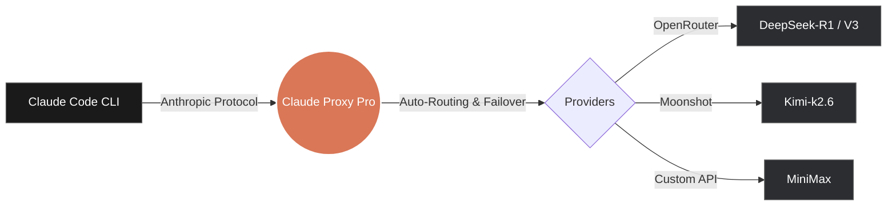

# 🦀 Claude Proxy Pro

> **"You won't have to sell your kidney to use Claude Code anymore! hahaha"** 💸

**Claude Proxy Pro** is an ultra-lightweight, blazing-fast, and standalone desktop application built entirely in **Go** and **Wails**. It serves as an invisible, highly intelligent bridge between Anthropic's amazing [Claude Code](https://github.com/anthropics/claude-code) CLI and **ANY** LLM provider of your choice.

## 🚨 The Problem: Claude Code is Expensive!
Recent news and developer reports have highlighted that while Claude Code is arguably the most powerful agentic coding tool available, its heavy reliance on autonomous "thinking" and "tool-use" loops consumes tokens at a terrifying rate. Active developers are reporting API bills upwards of **$150 to $250+ per month**. 

## 🦸‍♂️ The Solution: Claude Proxy Pro
Instead of relying on heavy Python or Node.js terminal scripts, we built a native, standalone proxy app. 

With **Claude Proxy Pro**, you can instantly route your Claude Code traffic to cheaper (or free!) hyped models that are making waves right now, such as **DeepSeek-R1**, **Kimi**, or **MiniMax**, while keeping the flawless Claude Code terminal experience exactly the same.

### ⚡ Architecture Flow

### 🥊 Comparison: Why we are better
Many open-source alternatives (like "Free Claude Code" wrappers) are built using Node.js or Python. While they work, they are heavily bloated, require installing runtimes (npm/pip), and run purely in the terminal. 

Claude Proxy Pro is a **standalone GUI application** that leaves them in the dust:

| Feature | Claude Proxy Pro 🦀 | Free Claude Code (Node/Py) | Electron Alternatives |
|---------|---------------------|---------------------------|-------------------|
| **Core Engine** | Pure Go (Compiled) | Node.js / Python scripts | Electron / TypeScript |
| **RAM Usage** | **~88 MB** 🔥 | ~150 MB - 300 MB | 500 MB+ 🐢 |
| **Installation** | Single Click (`.app` / `.exe`) | Needs `npm install` or `pip` | Heavy installers |
| **User Interface**| Sleek Native Glassmorphism UI | Terminal / Command Line only | Clunky Web Views |
| **Claude Sync** | **100% Automatic** (`settings.json`) | Manual JSON editing | Manual / None |
| **Stability** | Smart Auto-Failover & Retry | Script crashes on API error | Basic retries |

### 💎 Key Features
- **Written in pure Go:** Consumes a microscopic **~88MB of RAM**.
- **Sleek Glassmorphism UI:** A gorgeous, native dashboard to manage your providers and models.
- **Auto-Syncs with Claude Code:** The moment you select a model in the UI, the proxy automatically injects it into your `~/.claude/settings.json`. Zero manual configuration required.
- **Failover & Auto-Retry:** If a provider goes down, the Stability Engine seamlessly retries or routes to a backup node without breaking your Claude Code session.
- **Live Hacker Terminal:** Watch your proxy route traffic in real-time with our built-in Matrix-style live system logs.

## 🛠 Installation
No Node.js. No Python. No dependencies.
Just head over to the [Releases Page](../../releases) and download the pre-compiled version for your system:
- **macOS:** Download the `.app.zip`, extract it, and drag it to Applications.
- **Windows:** Download the `.exe` and run it.
- **Linux:** Download the binary and execute it.

*(Works seamlessly on macOS, Windows, and Linux)*

## 🎮 How to use
1. Open **Claude Proxy Pro**.
2. Go to the **Providers** tab and add your favorite provider (e.g., OpenRouter) and your API Key.
3. Click **Sync Models** on the Models tab.
4. Pick the model you want (like `DeepSeek-R1`) and hit **Activate**.
5. Open your terminal and run `claude`. That's it!

---
*Built with ❤️ (and a lot of coconut juice) for the open-source community.*
